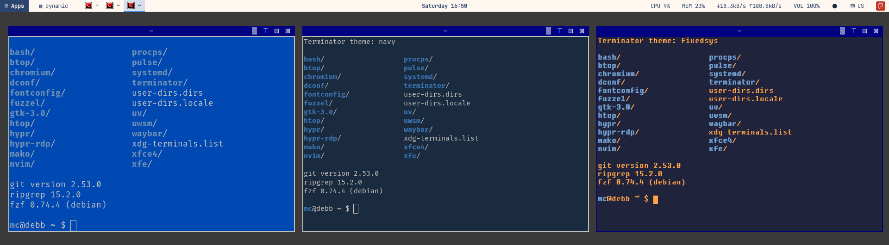

# Thin client Debian forky VM with minimal desktop

A [pyinfra](https://pyinfra.com) deployment that turns a minimal **Debian forky**
VM into a stripped-down **thin client**: a low-footprint Hyprland desktop that
you use over RDP.

* **Optimized for remote VM deployments**: Proxmox/KVM guests with no GPU,
  or with a VirGL GPU (virtio-gl, the host's iGPU) when the host has one.
  Nothing depends on graphics hardware; rendering, screen capture and the RDP
  stream are tuned for software rendering.
* **For Mac users** connecting with **Royal TS** or a similar RDP client
  (Apple keyboard layout, client-drawn cursor, lossless text).
* **For multitaskers** who want a purpose-built worker VM: terminals, AI
  agents, containers and a browser, nothing else.


It is explicitly **not** a laptop or desktop base OS: no display manager, no
GNOME/KDE, no power management, no Bluetooth, no printing. The VM boots
straight into Hyprland on tty1, and hypr-rdp serves that session.

## Quick start

```bash
TARGET_HOSTS=10.0.0.62 TARGET_USER=alice uv run pyinfra inventory.py deploy.py
uv run pyinfra inventory.py tasks/desktop.py       # one area only
```

[uv](https://docs.astral.sh/uv/) installs pyinfra from `pyproject.toml` /
`uv.lock` on first run; nothing else is needed on the controlling machine.
Every run is idempotent.

* `inventory.py` reads `TARGET_HOSTS` (comma-separated) and `TARGET_USER`. For
  fixed hosts, copy it to `inventory.local.py` (git-ignored), set `USER` /
  `HOSTS`, and run `uv run pyinfra inventory.local.py deploy.py`.
* The SSH user is also the desktop user (autologin, Hyprland, hypr-rdp).
* Settings for all hosts: `group_data/all.py`. Per-host overrides go into the
  host data dict, e.g. `{"ssh_user": "alice", "decorations_style": "mac"}`.

## New VM

1. **Proxmox VM**: CPU type `host`, 3+ cores, 6+ GB RAM (ballooning min = max),
   VirtIO SCSI disk with *SSD emulation* + *Discard*, display *Standard VGA*
   (or *VirGL GPU* if the host has a GPU, see below), Options → *QEMU Guest Agent* enabled.
2. **Install Debian forky** from the daily netinst ISO
   (`https://cdimage.debian.org/cdimage/daily-builds/daily/arch-latest/amd64/iso-cd/debian-testing-amd64-netinst.iso`).
   In *Software selection* tick only **SSH server** + standard utilities.
3. **Access** (once, on the VM as root; replace `alice` with your user):
   ```bash
   echo 'alice ALL=(ALL:ALL) NOPASSWD: ALL' > /etc/sudoers.d/zz-alice-nopasswd
   chmod 440 /etc/sudoers.d/zz-alice-nopasswd
   ```
   and from your machine: `ssh-copy-id alice@VM-IP`.
4. **Deploy**: `TARGET_HOSTS=VM-IP TARGET_USER=alice uv run pyinfra inventory.py deploy.py`
   (about 15 min; hypr-rdp comes as a prebuilt .deb from this repo's releases).
5. **Reboot** once (kernel options, limits), then connect with RDP as `alice`.
   The password is generated on the VM: `ssh alice@VM-IP cat ~/.config/hypr-rdp/password`.

## What it sets up

| Task | |
|---|---|
| `apt_forky` | deb822 sources for forky (+updates, security), never install recommends, full upgrade |
| `base` | purges desktop tasks, GNOME, KDE and display managers if present |
| `memory` | zram swap, reclaim sysctls, earlyoom, journald/coredump limits |
| `tuning` | network, filesystem, kernel command line, limits, modules, SSH |
| `services` | disables cups/avahi/bluetooth/ModemManager/power-profiles if present; qemu-guest-agent |
| `containers` | rootless podman with `docker` / `docker compose` / `docker-compose` aliases |
| `fonts` | Nerd Fonts 3.5.1: FiraCode (terminals), JetBrainsMono (UI); Fixedsys Core / Excelsior; emoji/symbol fallback (Noto Color Emoji, Symbola); font rendering |
| `desktop` | Hyprland + uwsm, hyprbars title bars, waybar, mako, fuzzel, Terminator, desktop scripts |
| `hypr_rdp` | patched hypr-rdp, config, per-host password, session helpers |
| `apps` | LibreOffice Calc + Writer (UI English/German, spelling de + en-US), Chromium + chromedriver (for MCP), Vivaldi, Sublime Text, Typora, Obsidian, Meld, rsync, rclone, git, gh, atop, Neovim, Node.js, xfce4-terminal, multitail, ripgrep, fzf (+ bat, tree), Ristretto (images), qpdfview (PDF), Little Snitch, Rust coreutils |
| `user_tools` | uv, pnpm, Aikido Safe Chain, Neovim config (nvim-simple), rclone mounts (OneDrive), ccusage, euporie, pretty-mermaid skill |
| `shell` | grml-inspired bash, Kali-style history, xfce4-terminal paste review |
| `themes` | btop and Claude Code themes for each Terminator theme; Chromium frame colour |
| `private` | your private data (encrypted in the repo): proprietary fonts, license keys |
| `autologin` | tty1 autologin → uwsm → Hyprland |

## Tuning, and why

All values are switches in `group_data/all.py`.

**Rendering with a VirGL GPU.** With Proxmox display *VirGL GPU* (virtio-gl;
the host needs `libgl1 libegl1`), Hyprland renders through the host's GPU
(here an Intel UHD 630) and nothing else changes; it picks up the GPU by itself.
Measured on a 3-core VM at 3198x1264, Hyprland + hypr-rdp CPU (100 % = one core),
hypr-rdp at 20 fps:

| Hyprland refresh | idle | mouse moving | terminal scrolling |
|---|---|---|---|
| 20 Hz | 18 % | 31 % | 23 % |
| 30 Hz | 20 % | 30 % | 19 % |
| 60 Hz | 21 % | 32 % | 21 % |

Hyprland alone takes 13–15 % while the mouse moves, at any refresh rate
(llvmpipe: 85 % at 20 Hz, 177 % at 60 Hz). The rest is hypr-rdp capturing and
encoding (ClearCodec, on the CPU). The software-rendering limits below don't
hurt with a GPU; `rdp_refresh_hz` can go up to 60. Raising `hypr_rdp_fps`
costs encoder CPU instead.

**Rendering and RDP (no GPU).** Without a GPU, Hyprland draws everything on
the CPU (llvmpipe). With a software cursor it redraws on every pointer motion,
even with the cursor hidden, and while the screen is being shared it also
refreshes a full-screen copy each time. So:

* The RDP output runs at **20 Hz** (`rdp_refresh_hz`) and hypr-rdp sends 20
  fps (`hypr_rdp_fps`). This caps the redraws caused by mouse movement. The
  pointer itself is drawn by the RDP client, so it stays smooth; raise both to
  30 if scrolling feels choppy.
* hypr-rdp is patched to request frames at most at that rate, and less often
  while nothing changes (capture pacing), and to use **ClearCodec**: lossless,
  only the changed areas, no H.264 encoder load.
* Terminal cursors don't blink and the bar updates every 5 s. Each blink or
  bar update is a full redraw plus capture.
* No animations, shadows or blur (except glass windows) by default; `MALLOC_ARENA_MAX=2` and
  `LP_NUM_THREADS=1` (`llvmpipe_threads`) keep memory and
  renderer overhead small: one llvmpipe thread halved the CPU of scrolling
  compared with 2 or 3 threads.
* The unused Proxmox console output is switched off while an RDP client is
  connected, so only one screen is drawn.

**Memory.** Agents and workloads sometimes need all of it.

* **zram** (`zram_*`): compressed swap in RAM, **lz4**, half the RAM, with the
  disk swap behind it. lz4 costs little CPU; numeric data compresses poorly
  anyway, so zstd's better ratio isn't worth it here.
* Reclaim sysctls tuned for zram (`vm_swappiness` 100, `page-cluster=0`,
  watermarks, `dirty_bytes`): idle memory is compressed early instead of
  starving the page cache, and writeback doesn't stall in big bursts.
* **earlyoom** steps in before the kernel OOM killer and never picks the
  desktop/RDP stack (Hyprland, waybar, hypr-rdp, PipeWire, sshd).
* `/tmp` is RAM-backed and capped at 1 GB (`tmp_size`), so a build or an agent
  can't fill half the memory with temp files.
* The desktop itself uses about 350 MB: waybar/mako/fuzzel instead of a
  full shell, a plain background colour instead of a wallpaper image.

**CPU priority.** Rootless containers get CPU weight 200
(`container_cpu_weight`), the desktop and terminals 100. This only matters
when all cores are busy: then containerised jobs get about two thirds of the
CPU, while RDP and terminals stay usable.

**Kernel** (`tune_kernel_cmdline`, needs a reboot):

* `mitigations=off audit=0`: no Spectre/Meltdown mitigations and no audit
  subsystem; faster syscalls and context switches. Only for a VM that runs
  nothing untrusted.
* `cpuidle_haltpoll.force=1 cpuidle.governor=haltpoll`: idle vCPUs poll
  briefly before halting, so the VM reacts faster to RDP input (costs a
  little host CPU).
* Soft-lockup watchdog off (false alarms when the host is busy); floppy,
  pcspkr and joydev blacklisted.

**Network and disk.** BBR + fq and larger TCP buffers (`tune_net`) help on
WAN links; root filesystem `noatime,commit=60` (`tune_noatime`) cuts metadata
writes. The virtual disk stays on the `none` I/O scheduler: the Proxmox host
schedules the real disks.

**Limits.** 65536 open files (`nofile_*`) and 1024 inotify instances: Node,
Java, dev servers and agents run out of the defaults (1024 / 128).

## RDP

hypr-rdp 0.1.6 attaches to the running Hyprland session. On connect, the
console output is switched off, Hyprland's own cursor is hidden (the client
draws one; it reappears in window resize zones to show the resize arrow),
off-screen windows are pulled back, and the RDP window size survives config
reloads. On disconnect the console comes back.

Patches (`files/hypr-rdp/`): `clearcodec.patch` (`hypr_rdp_codec =
"clearcodec"`), `planar.patch` + `ironrdp-planar.patch` (legacy bitmaps, not
supported by Royal TS), `capture-pacing.patch`.

### .deb via Dagger

pyinfra installs hypr-rdp from this repository's GitHub release
(`hypr_rdp_source = "release"`, checksum in `group_data/all.py`); set it to
`"build"` to compile on the host instead. The release is built by CI: pushing
a tag `hypr-rdp-<version>` runs the Dagger module in `.dagger/`, which builds
the patched hypr-rdp in a clean Debian forky container and publishes the .deb.
Locally:

```bash
dagger call deb export --path=dist/ --allow-parent-dir-path   # dist/hypr-rdp-clearcodec_0.1.6-3_amd64.deb
```

## Desktop

| Keys | |
|---|---|
| SUPER + Return / SUPER + SHIFT + Return | Terminator / xfce4-terminal |
| SHIFT + PrtSc, then the key | one-shot Super, for keyboards without a free Super key (e.g. GPD Pocket: Windows key stays with Windows); SUPER badge in the bar while armed, Esc cancels |
| SUPER + A, ☰ Apps, right-click on the desktop | application menu (categories) |
| SUPER + E | file manager (Xfe) |
| SUPER + G / title bar ▒ | glass window on / off (see-through, light milky blur) |
| SUPER + P / title bar ⊤ | stay on top on / off |
| SUPER + Y, ● in the bar | next Terminator theme (bar: right-click = previous; in Terminator: right-click → Theme) |
| SUPER + Space | launcher (search) |
| SUPER + Escape, power button | log out, reboot, shut down |
| SUPER + W / F / ALT + F | close / fullscreen / maximize |
| SUPER + T | toggle floating / tiling (one window) |
| SUPER + L, ▦ in the bar | next layout mode |
| SUPER + M | show / hide minimized windows |
| SUPER + arrows, ALT + TAB | focus |
| SUPER + left / right drag | move / resize |
| SUPER + ß / ´ (+ SHIFT) | narrower / wider (shorter / taller) |

* **Glass and stay on top** (title bar ▒ and ⊤, above): the cobalt terminal is
  glass (82 % opaque, light milky blur) and pinned, so btop stays readable
  behind it. Each click shows a short on/off notification.
* **Layout modes** (`hypr-layout`): `dynamic` (floating; every app reopens
  where it was), `golden-h`, `golden-v`, `golden-spiral` (61.8 : 38.2 splits).
  Floating windows scale with the RDP window size and never end up with their
  title bar under the top bar (new, restored and moved windows are kept below it).
* **Title bars** (`hypr-deco win311|mac`): Windows 3.11 (navy, ▒ ⊤ ⊟ ⊠) or macOS
  style (red/green/blue/grey). ▒ makes a window glass: 82 % opaque with a light
  milky blur, e.g. to watch btop graphs through a terminal. Only glass windows are
  blurred; each one costs CPU while the content behind it changes (about 6 % extra
  Hyprland CPU over btop). ⊤ keeps a window above the others (Hyprland pin). Shadows: `hypr-shadow on|off` (off by default: CPU-drawn).
* **File manager**: Xfe, a small FOX-toolkit app (X11 via Xwayland) with a folder
  tree and file list like the Windows 3.11 File Manager, seeded with 3.11 colours.
* **Top bar**: app menu, launchers (Xfe, Terminator, Vivaldi), layout mode, window list, clock, CPU/MEM/net (numbers; `bar_graphs = True` adds a graph of the last 50 s via `hypr-sparkline`), volume (speaker icon: click mutes, scroll or hover slider adjusts),
  terminal theme (● in the theme's colour, click to switch), keyboard layout
  (⌨ US/DE, click to switch), power button. Drag a window to a screen edge for half / full size.

**Keyboard**: `keyboard_layout` / `keyboard_variant` / `keyboard_options` (default: German Apple
layout, `altwin:swap_ralt_rwin`, so SUPER is the right Option key). hypr-rdp
uses Hyprland's keymap, so the mapping is the same over RDP. German (no dead keys)
and US are loaded together: switch with `kbde` / `kbus`, `setxkbmap de|us`,
`hypr-kbd de|us` or the ⌨ bar button. The choice survives reloads and reboots,
and hypr-rdp follows it without reconnecting.

## Private data: fonts and licenses

Proprietary fonts and license keys can't go into a public repo, so they're kept
in `private/` (git-ignored) and committed only as the encrypted
`private.tar.age`, a bit like ansible-vault. It uses [age](https://age-encryption.org)
through the `pyrage` library, so nothing needs to be installed on the controller.

**This repo's `private.tar.age` and `private.recipients` belong to the author.**
Using this repo yourself: delete both files and either do without private data
(the deploy just skips it) or set up your own:

```bash
uv run python privdata.py keygen      # age key in ~/.config/age/keys.txt, added to private.recipients
cp -r private.example private         # then add fonts to private/fonts/, keys to private/licenses.toml
uv run python privdata.py seal        # -> private.tar.age: commit it (and private.recipients)
uv run python privdata.py open        # later: decrypt to private/ to edit, then seal again
```

* **Back up `~/.config/age/keys.txt`.** Without it `private.tar.age` can't be
  decrypted. `private.recipients` can also list SSH public keys (`ssh-ed25519
  ...`), so an unencrypted SSH key on another controller works too;
  `PRIVATE_IDENTITY=path1:path2` picks the identity files.
* The deploy uses `private/` when it exists, otherwise it decrypts
  `private.tar.age` in memory. Nothing decrypted is written to the repo.
* **Fonts** (`private/fonts/`) are installed to `/usr/local/share/fonts/private`.
* **Licenses** (`private/licenses.toml`, see `private.example/`): installed as
  `~/.local/share/licenses/licenses.toml` (mode 600). Sublime Text's license
  file is written where Sublime reads it. For apps that are activated in their
  own UI (Typora: Help → My License), use **Licenses** in the app menu or
  `hypr-licenses [app] [field]`. It copies the value to the clipboard, marked
  sensitive.

## Shell and tools

* **grml-inspired bash** (grml's own config is zsh-only): prompt with git
  branch and exit code, directory stack (`d`, `cd -2`), `..`, autocd, grml
  aliases and helpers (`mkcd cdt bk sll`), bash-completion.
* **Kali-style history**: 100k entries, timestamps, shared between
  terminals, prefix + Up/Down search.
* **xfce4-terminal**: pasting text with a line break opens an editable review
  dialog first.
* **Containers**: `docker`, `docker compose` and `docker-compose` run
  rootless podman without a daemon.
* **Terminator themes**: `default` (cobalt), `navy`, `fixedsys` (amber on navy,
  Fixedsys Core), `cream` (light: navy on cream). The ● bar button (click next, right-click previous), SUPER+Y,
  `hypr-termtheme <name>|next|prev` or right-click → Theme switches all open
  terminals; new ones (SUPER+Return, app menu) use the last choice. Tabs are a
  slim tmux-style line at the bottom; tab titles show just the directory. The
  tab bar takes the theme's font (Fixedsys Core for `fixedsys`) and colours.
  Terminal apps switch along: Claude Code (`~/.claude/themes`, live) and btop
  (reloads its config) get a matching theme; Neovim starts with Berg light for
  `cream` and Berg dark otherwise.

  
* **CLI tools**: ripgrep, fd, fzf (+ bat, tree for previews), multitail, aria2, btop,
  atop, lazygit, Neovim with [nvim-simple](https://github.com/norandom/nvim-simple)
  (CUA keys, F10 menu bar, Berg theme; pinned in `nvim_simple_commit`). An old
  LazyVim config is moved to `~/.config/nvim.lazyvim`.
* **Rust coreutils**: uutils (`rust-coreutils`) comes first in `PATH` for your
  shells and the Hyprland session (`uutils_coreutils`); system services and root
  keep GNU coreutils.
* **Editors and apps**: Sublime Text (`subl`), Typora, Obsidian (pinned .deb,
  checksum verified), Vivaldi. Sublime, Typora and Vivaldi come from the vendors'
  apt repositories (deb822 sources pinned to their keys).
* **Files and sync**: rsync, Meld (graphical diff and merge for files and
  folders, like WinDiff), rclone (GitHub release, pinned).
* **OneDrive (personal)** via rclone: `rclone_mounts` maps a remote to a folder
  in your home (`onedrive` → `~/OneDrive`), mounted by the user service
  `rclone-onedrive` (FUSE, full VFS cache up to 2 GB). Set up the remote once,
  in a terminal in the RDP session (the login opens in the browser there):

  ```bash
  rclone config        # n) new remote, name: onedrive, storage: onedrive,
                       # defaults, "Use web browser to authenticate": yes,
                       # then "OneDrive Personal or Business" -> the personal drive
  systemctl --user restart rclone-onedrive
  ```

  Until the remote exists the service is skipped. The token lives in
  `~/.config/rclone/rclone.conf` on the host (rclone refreshes it); it isn't
  part of the private data.
* **Viewers**: Ristretto (images), qpdfview (PDF: tabs, annotations), Xfe (files).
* **TUIs**: `glow` (Markdown), `posting` (HTTP/API client), `trip` (trippy:
  traceroute + ping), `gdu` (disk usage), `podman-tui` (containers; uses the
  socket-activated user `podman.socket`), `zellij` (terminal workspaces), `upmd`
  (run tasks and workflows from Markdown code blocks), `euporie-notebook`
  (Jupyter notebooks in the terminal, with a Python kernel). podman-tui, zellij
  and upmd come from their GitHub releases (pinned, checksum verified,
  `release_tools`).
* **AI agents**: `ccusage` (Claude Code token usage and cost) and the Claude Code
  skill *pretty-mermaid* (Mermaid diagrams as SVG or terminal ASCII).
* **Little Snitch for Linux** (obdev.at, `littlesnitch_version`; kernel 6.12+
  with BTF): network monitor and per-app rules. Web UI on `http://localhost:3031/`
  (menu: Little Snitch, opens in Chromium). Built for privacy, not security.
* **Supply chain**: Aikido Safe Chain wraps npm, npx, pnpm, pip, uv and uvx
  and blocks packages younger than 48 hours.
