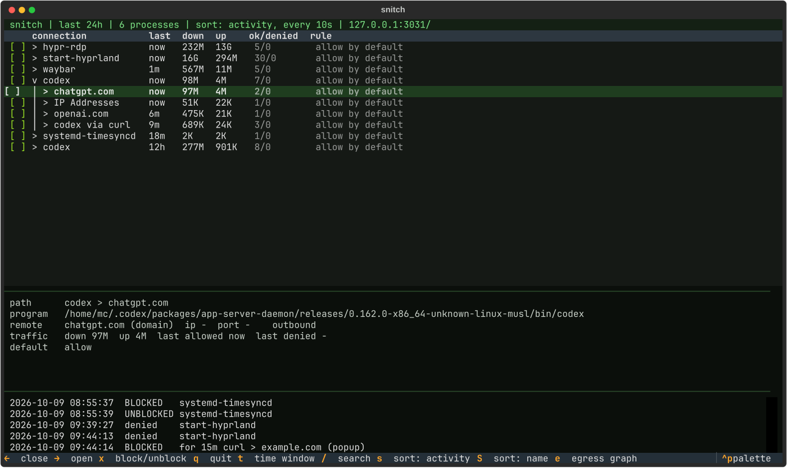
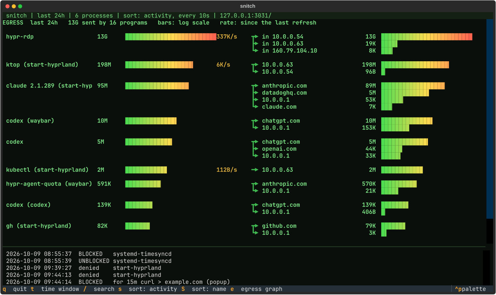
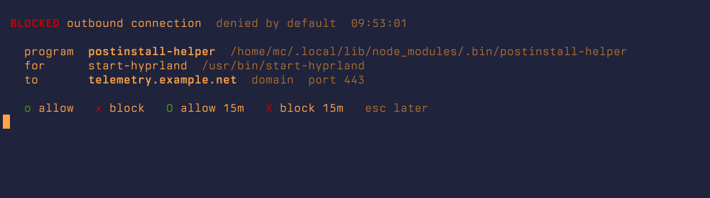

# snitch: network control for a thin client

This VM is a thin client for day-to-day work: reached over RDP, updated often, with agents
that keep working on a task while you're away. It should stay that easy to work on without
handing your data and your work to a mistake or a poisoned package. `snitch` and the away
lock are the two pieces for that:

* **snitch** puts [Little Snitch for Linux](https://obdev.at/littlesnitch-linux) in the
  terminal: see every connection, block it with one key, and get a popup for anything new.
* **hypr-away** locks the box while you're not connected: no passwordless sudo, no rule
  changes, no reading other processes' memory.

## The overview



`snitch` (or a click on the shield in the bar) shows the daemon's own tree: process ›
host › address, with the details of the selected row below and the log at the bottom.

| key | |
|---|---|
| ↑ ↓ | move, the details follow |
| enter / → | open · ← close |
| `x` | block · `x` again unblocks (`[x]`) |
| `t`, `1`…`5` | time window 15m / 30m / 1h / 24h / 7d |
| `s` / `S` | sort by activity (re-sorted every 10 s, `s` again 20 s) / by name |
| `/` | search |
| `e` | egress graph |

Blocking `hypr-rdp` (your session) takes a second `x`.

## Where does the data go?



`e` (or a right-click on the shield) shows what each program sends, and where to: btop-style
bars on a log scale, so 12 GB and 50 KB are both visible, plus the live rate. The sender is the
program that really talks (`ktop`), with the one that started it in brackets.

## Alerts



With **deny by default**, a connection no rule covers is blocked and a popup asks:

| key | |
|---|---|
| `o` / `x` | allow / block from now on |
| `O` / `X` | allow / block for 15 minutes (`temporary` in the config) |
| esc | decide later (asks again after `snooze`, 10 min) |

The popup ignores keys for its first 0.6 s, so it can't catch an `o` or `x` you were typing
somewhere else. The program has to retry after you allow it; nothing is held open.

Every answer is an ordinary Little Snitch rule (*"snitch popup …"*): listed, editable and
deletable in the web UI, and 15-minute rules expire inside the daemon itself. Decisions and
blocks are logged to `~/.local/state/snitch/snitch.log`.

```sh
snitch default deny    # baseline rules first (RDP, DNS, DHCP, NTP, apt), then deny by default
snitch default allow   # back
```

The baseline keeps your RDP session and the system's own needs open, so deny by default can't
lock you out. In the bar, the shield is solid for deny, an outline for allow, and red when the
popups aren't running (`snitch-watch.service`).


## The away lock

You are the pro while you're connected: nothing changes. When the RDP session is gone for
10 minutes (`away_grace_seconds`), `hypr-away` (root) locks:

* `sudo` asks for your password: agents still running on lose root
* nothing running as you can reach the Little Snitch UI: no rule changes, no "filter off"
* `ptrace_scope=1`: processes can't read each other's memory

Reconnect and it unlocks within seconds. "Connected" means a session from another machine,
served by the real `/usr/bin/hypr-rdp`, with picture data flowing, so a bare TCP connect
without the password, or a connection a local process makes itself, doesn't count.
`sudo journalctl -u hypr-away` shows every lock and unlock.

## What this does and doesn't stop

| | |
|---|---|
| ✅ a package phoning home | denied by default, you get asked |
| ✅ unattended agents doing something unplanned while you're away | no sudo, no new rules |
| ✅ malware adding allow rules while you're away | the UI is closed to your processes |
| ⚠️ malware while you're connected | you have passwordless sudo then, and that is root. Watch the popups and the egress graph |
| ⚠️ the RDP password | stored in plain text in `~/.config/hypr-rdp/password`. Keep it different from your login password |
